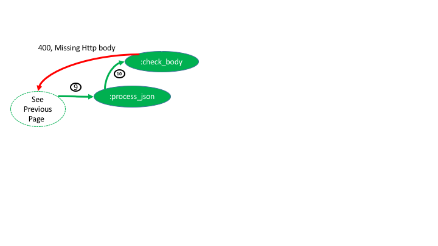
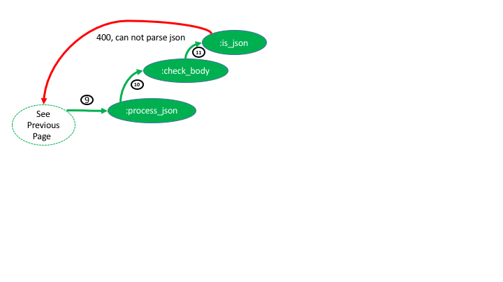
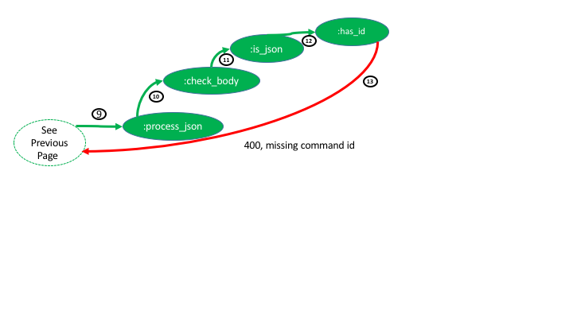
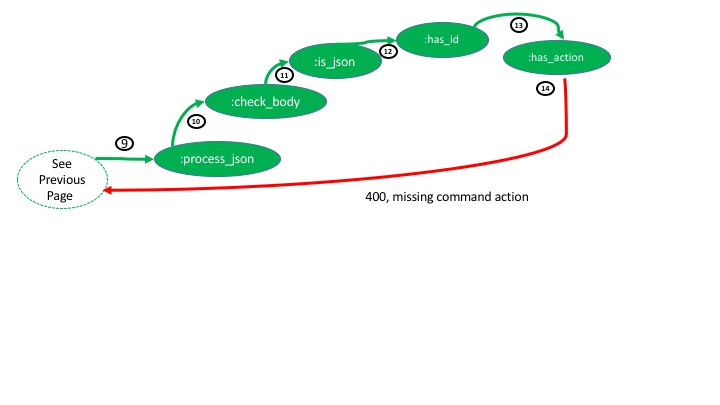
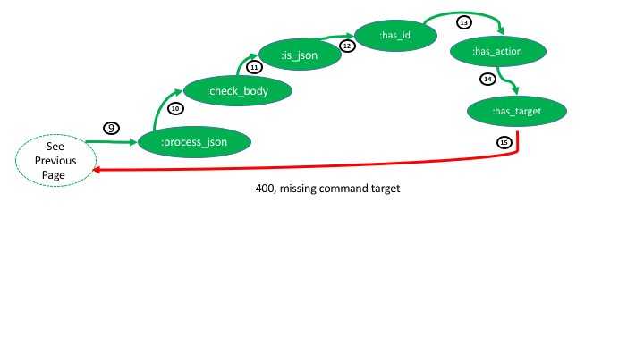
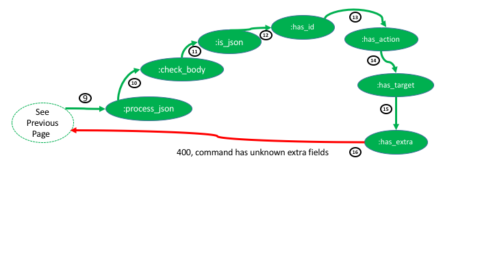
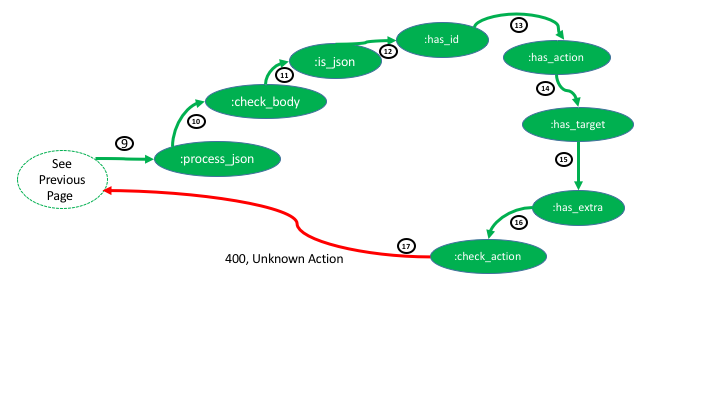
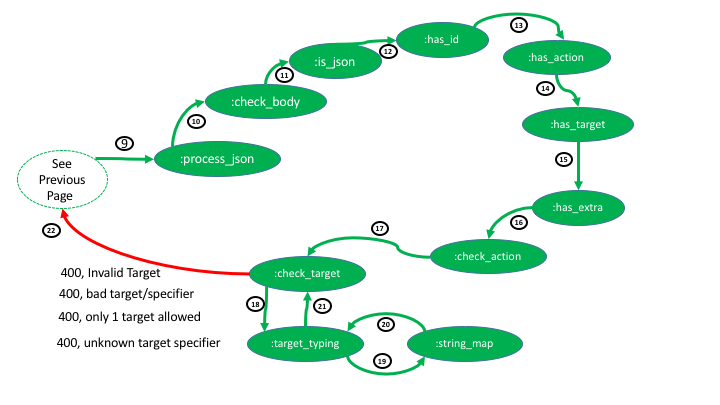

# haha

An OTP application implementing the Https Api Hello-world Acutator (HAHA or haha).
This is a typical "Hello World" in that it does not provide any real security functions.
It is a simple getting-started of a very simple OpenC2 consumer interface.

Haha has a very simple OpenC2 interface.
The only OpenC2 action that haha accepts
is the query action with either the _openc2_ target (returns the profile or the schema)
or the _hello_ target (an custom extension to OpenC2) (returns "World").

More info on haha can be found at (add link).
The actuator profile for haha can be found at (add link).

More info on OpenC2 can be found at (add link).

Once haha is mastered, a more advanced "Hello World" can be found
in haga (add link), the Https Api Global-welcome Actuator.

Real actuators can be found at (add links for bawnl, etc).

## 1. Build

    $ rebar3 compile

## 2. Test

    $ rebar3 -ct

## 3. Run

    $ whatever (not ready yet)

## 4. Design
The flow thru the functions will be shown both sunny day and rainy day.

### 4.1 Sunny Day flow - Hello World
Figures 1 & 2 show the flow thru the modules for the following OpenC2 command. Note much of the movement between functions it tail recursive.

```json
{
"id": "0b4153de-03e1-4008-a071-0b2b23e20723",
"action": "query",
"target": "Hello World"
}
```


Figure 1


Figure 2

The response will be:

Status
* 200 OK

Headers:
* content-length →13
* content-type →application/json
* date →Fri, 27 Jul 2018 15:29:15 GMT
* server →Cowboy

Body
* "Hello World"

### 4.2 Sunny Day flow - query openc2
Figs 1 & 2 also represent the flow for the following command:

```json
{
  "id": "0b4153de-03e1-4008-a071-0b2b23e20723",
  "action": "query",
  "target": {
    "openc2": { "version": "", "profile" : "", "schema": "" }
     }
}
```

The response will be:

Status
* 200 OK

Headers:
* content-length →2958
* content-type →application/json
* date →Fri, 27 Jul 2018 15:42:53 GMT
* server →Cowboy

Body
```json
{
    "x_haha": "https://github.com/sparrell/openc2-cap/haha.cap.md",
    "version": "1.0",
    "schema": {
        "meta": {
            "module": "TBSL on where to put haha",
            "title": "Https Api Helloworld Actuator (haha)",
            "version": "wd01-wip",
            "description": "Datatypes that define the content of OpenC2 commands and responses for haha",
            "imports": [
                [
                    "jadn",
                    "/oasis-open.org/openc2/v1.0/jadn"
                ]
            ],
            "exports": [
                "OpenC2-Command",
                "OpenC2-Response"
            ]
        },
        "types": [
            [
                "OpenC2-Command",
                "Record",
                [],
                "The OpenC2 Command describes an action performed on a target. It can be directive or descriptive depending on the context.",
                [
                    [
                        1,
                        "action",
                        "Action",
                        [],
                        "The task or activity to be performed (i.e., the 'verb')"
                    ],
                    [
                        2,
                        "target",
                        "Target",
                        [],
                        "The object of the action. The action is performed on the target"
                    ],
                    [
                        5,
                        "id",
                        "Command-ID",
                        [
                            "[0"
                        ],
                        "Identifier used to link responses to a command"
                    ]
                ]
            ],
            [
                "Action",
                "Enumerated",
                [],
                "",
                [
                    [
                        3,
                        "query",
                        "Initiate a request for information."
                    ]
                ]
            ],
            [
                "Target",
                "Choice",
                [],
                "OpenC2 Target datatypes",
                [
                    [
                        16,
                        "openc2",
                        "OpenC2",
                        [],
                        "A set of items used with the query action to determine an actuator's capabilities"
                    ]
                ]
            ],
            [
                "OpenC2-Response",
                "Record",
                [],
                "",
                [
                    [
                        1,
                        "id",
                        "Command-ID",
                        [],
                        "Id of the ommand that induced this response"
                    ],
                    [
                        2,
                        "status",
                        "Status-Code",
                        [],
                        "An integer status code"
                    ],
                    [
                        3,
                        "status_text",
                        "String",
                        [
                            "[0"
                        ],
                        "A free-form human-readable description of the response status"
                    ],
                    [
                        4,
                        "*",
                        "Results",
                        [],
                        "Data or extended status information that was requested from an OpenC2 command"
                    ]
                ]
            ],
            [
                "Status-Code",
                "Enumerated",
                [
                    "="
                ],
                "",
                [
                    [
                        102,
                        "Processing",
                        "An interim response used to inform the client that the server has accepted the request but not yet completed it."
                    ],
                    [
                        200,
                        "OK",
                        "The request has succeeded."
                    ],
                    [
                        301,
                        "Moved Permanently",
                        "The target resource has been assigned a new permanent URI"
                    ],
                    [
                        400,
                        "Bad Request",
                        "The server cannot process the request due to something that is perceived to be a client error (e.g., malformed request syntax.)"
                    ],
                    [
                        401,
                        "Unauthorized",
                        "The request lacks valid authentication credentials for the target resources or authorization has been refused for the submitted credentials."
                    ],
                    [
                        403,
                        "Forbidden",
                        "The server understood the request but refuses to authorize it."
                    ],
                    [
                        500,
                        "Server Error",
                        "The server encountered an unexpected condition that prevented it from fulfilling the request."
                    ],
                    [
                        501,
                        "Not Implemented",
                        "The server does not support the functionality required to fulfill the request."
                    ]
                ]
            ],
            [
                "Body",
                "Choice",
                [],
                "",
                [
                    [
                        1,
                        "command",
                        "OpenC2-Command",
                        [],
                        "A command"
                    ],
                    [
                        2,
                        "response",
                        "OpenC2-Response",
                        [],
                        "A response"
                    ]
                ]
            ],
            [
                "OpenC2",
                "ArrayOf",
                [
                    "*Query-Item",
                    "[0",
                    "]3"
                ],
                "A target used to query Actuator for its supported capabilities"
            ],
            [
                "Query-Item",
                "Enumerated",
                [],
                "Results to be included in response to query openc2 command",
                [
                    [
                        1,
                        "versions",
                        "OpenC2 language versions supported by this actuator"
                    ],
                    [
                        2,
                        "profiles",
                        "List of profiles supported by this actuator"
                    ],
                    [
                        3,
                        "schema",
                        "Definition of the command syntax supported by this actuator"
                    ]
                ]
            ],
            [
                "Command-ID",
                "String",
                [],
                "Uniquely identifies a particular command - TBD syntax"
            ]
        ]
    }
}
```

Rainy Day flows -
several error paths will be followed.

### 4.3 Rainy Day - GET
Only Post is supported (as Cowboy http server is instructed
  per "allowed_methods").
Figure 3 shows the error path.


Figure 3

The response is:

Status
* 405 Method Not Allowed

Headers:
* allow →POST
* content-length →0
* date →Fri, 27 Jul 2018 15:54:28 GMT
* server →Cowboy

No Body

### 4.4 Rainy Day - non-json Content-Type
The haha server only accepts json,
so if a non-json content type is sent,
cowboy returns unsupported media type.


Figure 4

Status:
* 415 Unsupported Media Type

### 4.5 Rainy Day - JSON handling
Figure 5 is common to all the remaining error flows.


Figure 5

### 4.6 Rainy Day - Missing Http Body
If no body exists on the post, it returns 400 with the body "Missing Http Body"



Figure 6

### 4.7 Rainy Day - Invalid json
If invalid json (eg command below) is sent, 400 "can not parse json" is returned

```json
{
]"id": "0b4153de-03e1-4008-a071-0b2b23e20723",
"action": "query",
"target": "Hello World"
}
```



Figure 7

### 4.8 Rainy Day - Missing Command Id
Command ID is required for this actuator.



Figure 8

### 4.9 Rainy Day - Missing action
An action is required.



Figure 9

### 4.10 Rainy Day - Missing Target
A target is required.


Figure 10

### 4.11 Rainy Day - Extra fields
Extra fields (ie other than Id, Action, Target)
will cause this actuator to error.
For example:

```json
{
    “id” :  “1234”,
    "action": ”query",
    "target": ”Hello World”,
    “args” : {“duration” : “3s”}
}
```

Note args is allowed in OpenC2 but not for this actuator.



Figure 11


### 4.12 Rainy Day - Unknown action
Only query is valid for this atuator.



Figure 12


### 4.13 Rainy Day - Target specifier errors
Several error some from malformed or unknown specifiers



Figure 13
