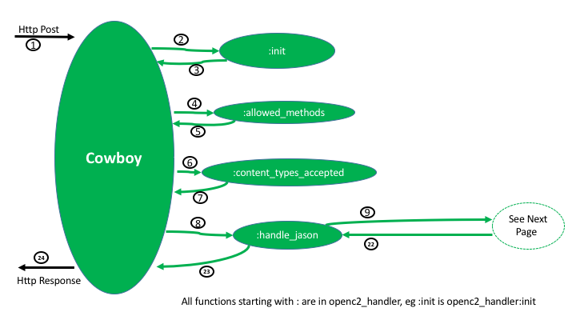
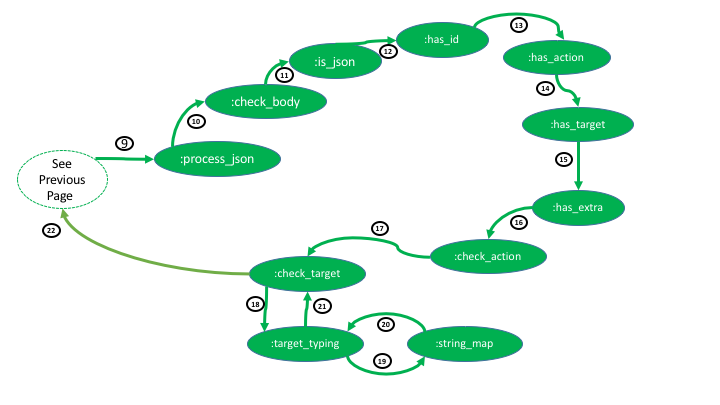
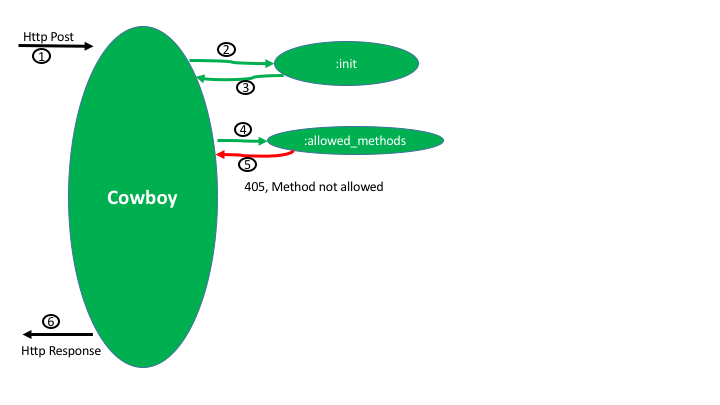
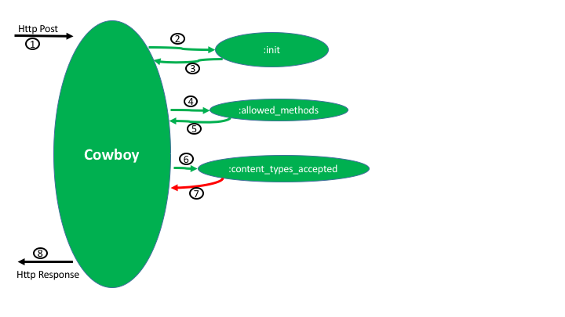

haha
=====

An OTP application implementing the Https Api Hello-world Acutator (HAHA or haha).
This is a typical "Hello World" in that it does not provide any real security functions.
It is a simple getting-started of a very simple OpenC2 consumer interface.

Haha has a very simple OpenC2 interface.
The only OpenC2 action that haha accepts
is the query action with either the _openc2_ target (returns the profile or the schema)
or the _hello_ target (an custom extension to OpenC2) (returns "World").

More info on haha can be found at (add link).
The actuator profile for haha can be found at (add link).

More info on OpenC2 can be found at (add link).

Once haha is mastered, a more advanced "Hello World" can be found
in haga (add link), the Https Api Global-welcome Actuator.

Real actuators can be found at (add links for bawnl, etc).

Build
-----

    $ rebar3 compile

Test
-----

    $ rebar3 -ct

Run
-----

    $ whatever (not ready yet)

Design
-----
blah blah

blah blah

blah blah
note query Hello and query openc2 follow same path

blah blah

blah blah
